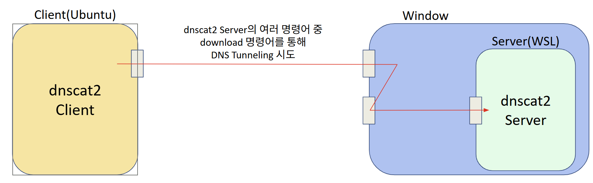
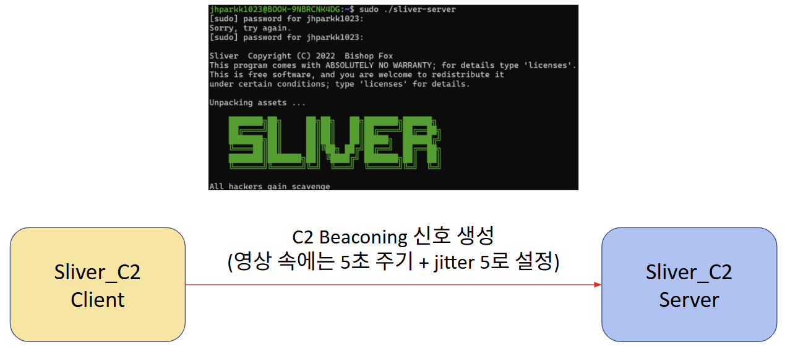
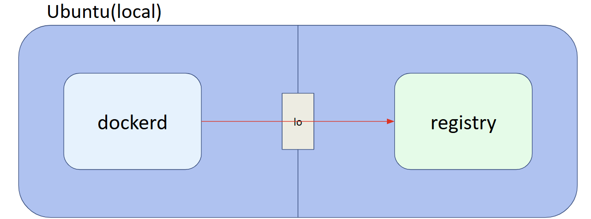

# Aegis-BPF

__eBPF 기반 실시간 커널 트래픽 분석 및 초경량 사용자 중심 보안 시스템__

## 1. Project Overview

- __Background__: 개발 친화적인 Linux 데스크톱 환경의 점유율이 상승하고 있으나, 기존 개인용 보안 프로그램은 잦은 Context Switching을 유발하여 시스템 성능을 크게 저하시키는 구조적 한계가 존재

- __Objective__: 리눅스 커널 수준의 eBPF 기술을 사용하여 Context Switching을 최소화하고 시스템 자원 소모를 최소화 하는 사용자 친화적 실시간 보안 시스템을 제안

## 2. Core Features

- __Kernel-level Inline Filtering__: 패킷이 NIC로 빠져나가기 직전인 TC에서 bpf_tc_egress Hook을 통해 실시간 패킷 검사 수행. 위협으로 판단되는 패킷은 즉시 TC_ACT_SHOT을 반환하여 유저 영역 개입 없이 커널 계층에서 DROP.

- __Lock-Free Concurrency Optimization__: 대용량 트래픽 환경에서 멀티코어 CPU의 Lock 충돌을 방지하기 위해 통계 수집 맵인 map_stats을 BPF_MAP_TYPE_LRU_PERCPU_HASH로 설계. 각 코어가 독립적인 메모리 공간에 패킷 통계를 기록.

- __Host-based Process Visibility__: 패킷의 IP/Port 4-Tuple 정보만으로는 추적하기 힘든 악성 행위의 주체를 식별. kprobe/tcp_sendmsg 훅을 사용하여 커널 소켓 정보와 bpf_get_current_pid_tgid()를 결합하여 어떤 프로세스(PID, comm)가 해당 트래픽을 발생시켰는지를 매핑. 

- __Asynchronous Polling & Zero-Copy__: 유저 스페이스 데몬(controller.c)은 패킷 페이로드를 복사해 가져오는 대신, epoll과 timerfd를 이용해 1초 주기로 커널 map의 통계치만 비동기적으로 폴링. 이를 통해 context switching을 최소화.

- __Automated Garbage Collection__: 소켓이 닫히는 시점인 kprobe/tcp_close에 Hook을 걸어서 종료된 세션의 BPF Map 데이터를 즉시 삭제. 이를 통해 발생할 수 있는 커널 메모리 누수를 차단.

## 3. System Architecture

- Aegis-BPF는 Kernel Space와 User Space의 분리된 아키텍처로 구성

- <아키텍처 그림>

### Kernel Space(데이터 수집 및 즉각 차단)

- __1. Flow & Process Mapping(map_process)__
    - tcp_sendmsg 시스템 콜에 Hook을 걸어서 IP와 Port를 추출
    - 추출된 4-Tuple key(Dest IP/port, Source IP/port)를 기준 삼아 패킷을 전송하는 주체의 프로세스 정보(aegis_process_info)를 LRU Hash Map인 map_process에 저장

- __2. Traffic Accounting (map_stats)__
    - TC Hook에서 Egress 패킷의 헤더를 파싱하여 L3, L4 정보를 추출
    - Per-CPU Hash Map인 map_stats을 사용하여 패킷 크기와 해당 시점의 타임스탬프를 Lock 없이 빠르게 추출 후 갱신.

- __3. Fast-Path Enforcement (map_enforcement)__
    - 패킷 송신 전, 정책 Map인 map_enforcment을 조회하여 flag == 1일 경우 TC_ACT_SHOT으로 패킷을 DROP.

### User Space(통계 분석 및 탐지 엔진)

- __1. Event Loop (epoll & timerfd)__
    - 1초 주기의 timerfd를 epoll을 통해 user space에 존재하는 분석 엔진(run_anomaly_engine 함수) 실행
- __2. Data Aggregation__
    - CPU 코어 별로 map_stats가 존재하므로 분산되어 저장되어 있는 map_stats에 있는 전송 바이트(tx_bytes)를 순회하며 total_tx_bytes로 병합
- __3. Threat Detection & Enforcement__
    - 병합된 데이터를 바탕으로 EMA(지수 이동 평균) 기반의 대량 유출 탐지와 IAT(Interval Arrival Time) 변동계수(CV) 기반의 C2 비코닝 탐지 로직을 연산
    - 위협이 탐지되면 커널의 map_enforcement 맵을 갱신하여 해당 트래픽을 실시간으로 차단

## 4.Threat Detection Algorithms

### Bulk Exfiltration & DNS Tunneling
- 지수 이동 평균(EMA)을 사용하여 트래픽의 연속적인 Byte Per-Second(BPS) 흐름을 추적
    $$EMA\_BPS = (0.2 \times \text{Current\_BPS}) + (0.8 \times \text{Previous\_EMA\_BPS})$$
    - 현재 BPS에 0.2의 가중치를 주고 현시점 직전까지 계산된 EMA_BPS에 0.8을 곱하여 현재 정보와 더불어 과거의 정보도 고려한 최종 EMA_BPS를 계산. 이를 통해 현시점만 보지 않고 과거부터 현재까지 해당 트래픽이 어떠한 특징을 가지는지를 표현.

- 일반 트래픽과 DNS 트래픽의 임계치를 각각 설정하여 조건 초과 시 패킷을 Drop 하도록 map_enforcement에 플래그(flag = 1)를 적용.
- DNS 프로토콜은 정상적인 경우, 필요한 hostname의 IP주소 등을 알아내는 과정을 거치므로 많은 양의 패킷들을 주고 받지 않고 한번 DNS search를 하고 나면 내부 cache에 IP 주소를 저장하므로 일정 시간 동안 DNS 프로토콜을 사용한 통신이 자주 이루어지지 않는 특성을 이용

### C2 Beaconing
- IAT(Interval Arrival Time)를 기반으로 전송 주기의 오차를 계산하고, 분산과 변동계수(CV)를 도출하여 악성 비커닝의 주기성을 판별

    - 오차 계산: $Diff = \Delta t - \text{Previous\_EMAinterval}$
    - 분산 업데이트: $EMAvariance = 0.8 \times (EMAvariance + 0.2 \times Diff^2)$ 
    - 표준편차($\sigma$) 및 변동계수 계산: $CV = \frac{\sigma}{\text{Current\_EMAinterval}}$
    - $CV < 0.10$인 경우, 일정한 주기성을 띄는 C2 비커닝으로 식별

- 정상적인 트래픽인 경우 인간의 불규칙적인 패턴으로 인해 CV가 0.1을 충분하게 초과하지만, 프로그래밍된 악성 트래픽들은 기계적 주기성을 띄우므로 CV가 정상 트래픽보다 낮게 측정되는 특징을 이용

## 5. Demo & Use Cases

### DNS Tunneling

- __dnscat2 사용__
    - DNS 프로토콜을 통해 암호화된 C&C 터널을 생성하도록 설계된 도구

<영상>

### C2 Beaconing

- __Sliver_C2 사용__
    - C2 Beaconing 모의 시험에 사용되는 오픈소스

<영상>

### Bulk-Exfilteration

- __local에서 docker image push 방식을 사용__
    - 대량의 데이터 유출이 발생되면 차단뿐만 아니라 데이터 유출 주체의 PID와 comm(프로세스 이름)도 함께 출력
- __의의__
    - eBPF 기술을 활용하여 실제 통신을 발생시킨 프로세스 이름(위 시나리오에서는 dockerd)과 고유 식별자를 정확히 알 수 있고 OS 커널 수준에서의 가시성을 확보.
    - __프로세스 직접 제어__: Living-Off-The-Land 방어가 가능. 탐지 즉시 유저 영역의 컨트롤러가 해당 PID에 강제 종료 시그널(SIGKILL)을 보내 데이터 유출의 근원지를 원천 차단할 수 있음
    - __보안 격리__: 리눅스의 cgroup이나 네임스페이스 제어와 연동하여, 악성 행위를 일으킨 컨테이너나 프로세스를 즉시 네트워크 환경에서 격리하는 능동적 대응이 가능

<영상>

## 6. Performance Evaluation

- 객관적인 검증을 위한 격리 환경 구축
    - 1호기(사용자): Ubuntu 환경에서 보안 엔진 구동 및 실시간 자원 소모량 감시 대상
    - 2호기(서버): iperf3를 사용하여 사용자가 던지는 패킷을 받는 역할
    - __격리 가상 네트워크__: 호스트 내부 통신망을 활용하여 외부 네트워크 간섭을 원천 차단
    - 상용 보안 솔루션: OpenSnitch

### CPU Overhead
- 시스템 병목의 주원인인 0번 코어의 집중 부하율을 70.0%에서 61.6%로 낮추어 약 8.4% 경감
- 상용 솔루션이 유저 영역 처리를 위해 구동하는 10~13개의 보안 전용 스레드 오버헤드를 제거

### Throughput
- 3회 반복 측정 평균 대역폭이 928.3 Mbps에서 962.3 Mbps로 향상(약 3.6%)
- 임계 부하 상황에서의 최저 대역폭을 717 Mbps로 방어

### Latency
- 커널 수준 패킷 처리로 평균 응답 속도 18.46% 개선
- 최대 병목 지연(Tail Latency) 26.54% 개선
